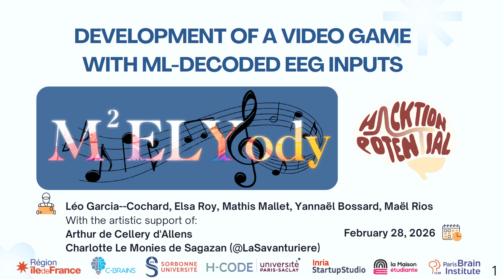
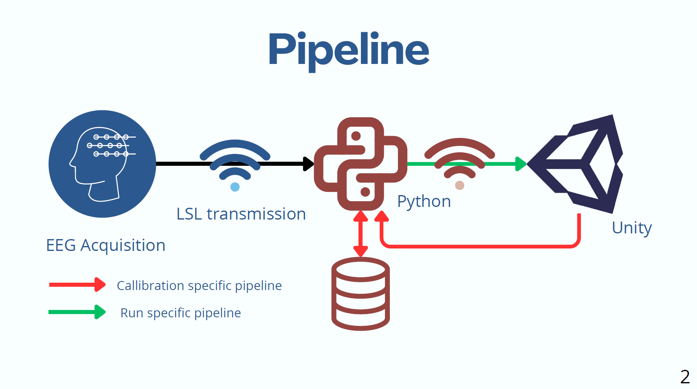
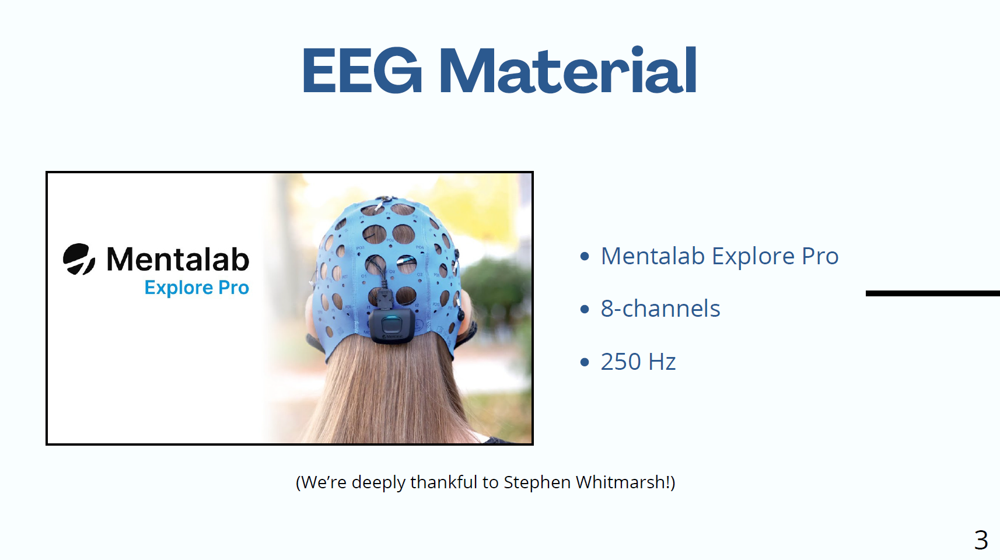
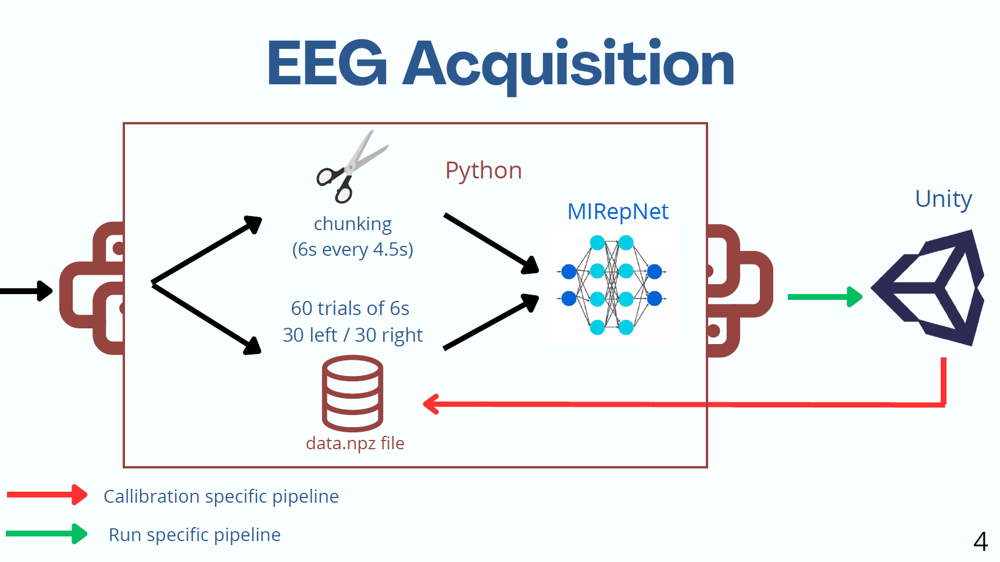
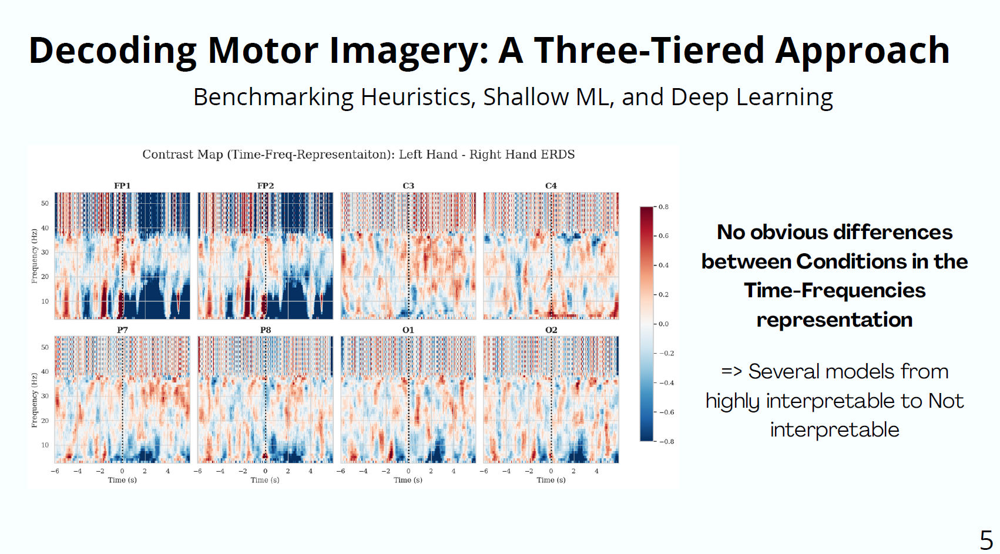
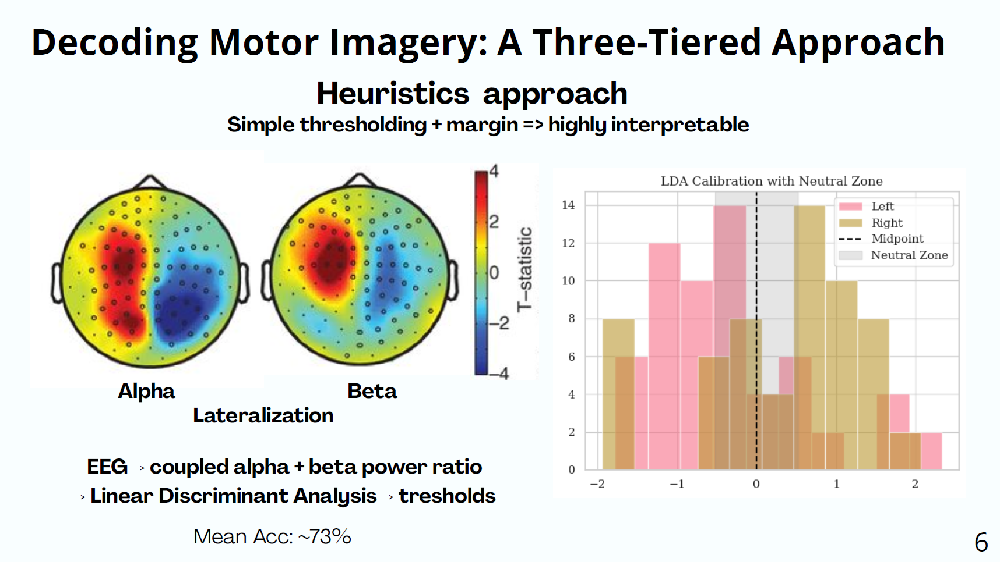
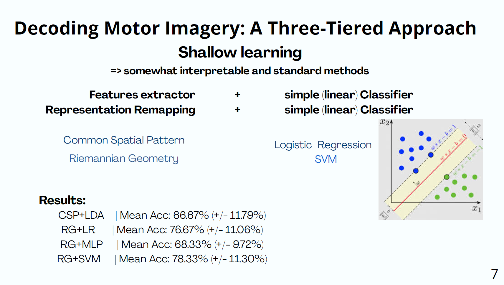
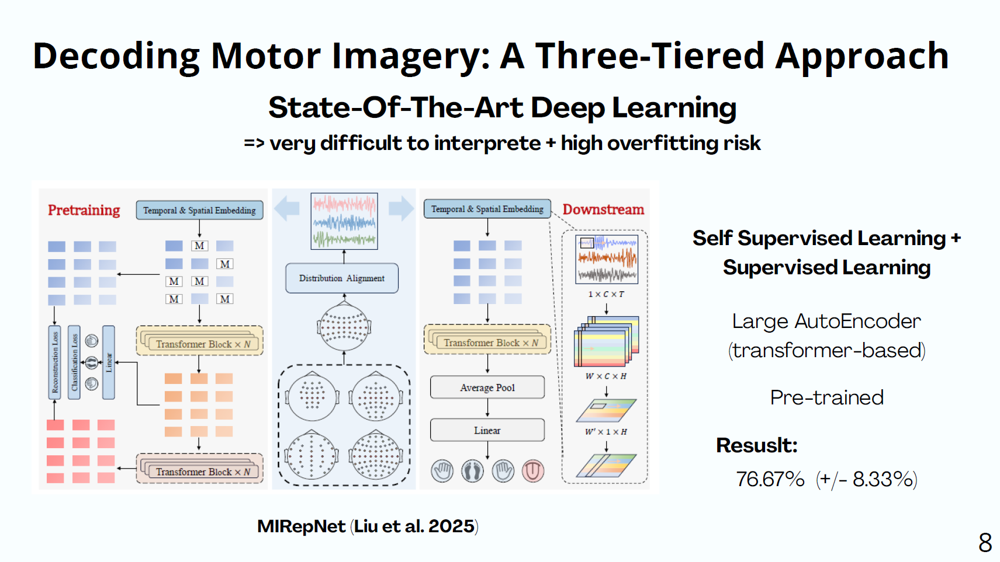
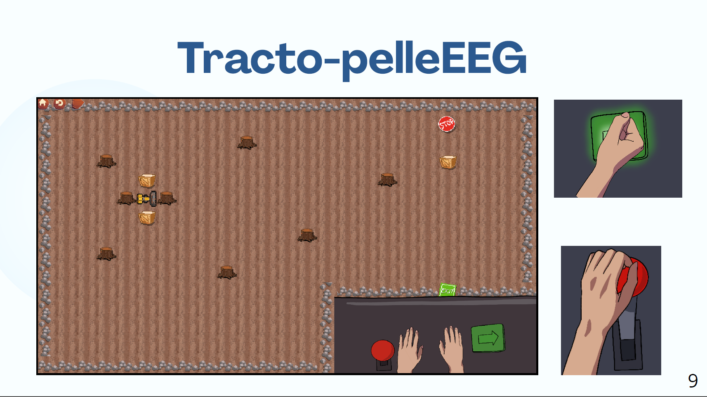
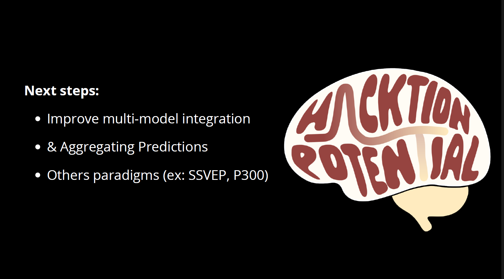

# Hackaton Potential 2026 TEAM M^2YELODY: GAME FROM EEG SIGNAL DECODING

This repository is the main repo of our hackaton work done by Mathis Mallet, Yannaël Bossard, Leo Garcia-Cochard, Elsa Roy, Maël Rios.

The goal of this Neurosciences focused hackaton project was to create an interactive game whose inputs would be derived from brain activity captured by an EEG and shared through LSL pipelibnes, decoding them with ML and DL models and algorithms.

You will find the main slides as well as the entire repository with the game, scripts and some rough datasets.

# SLIDES

  

  

  

  

  

  

  

  

  

  

